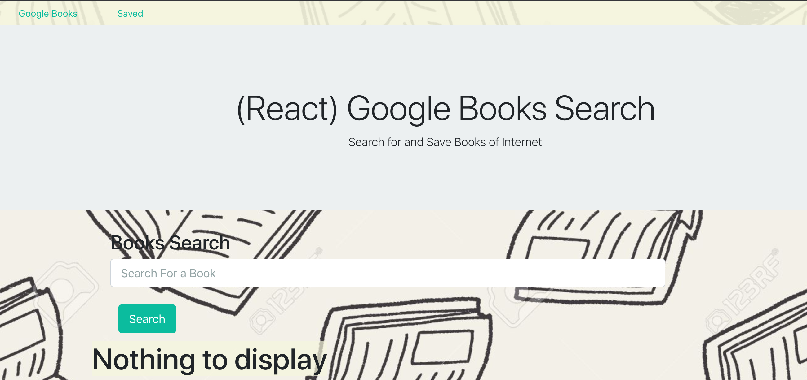
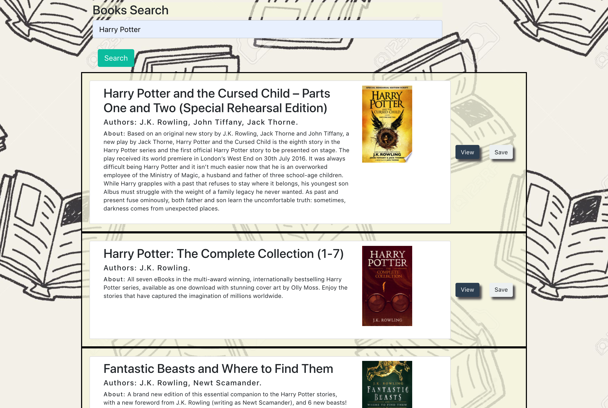
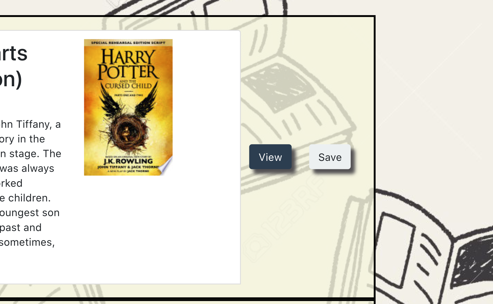
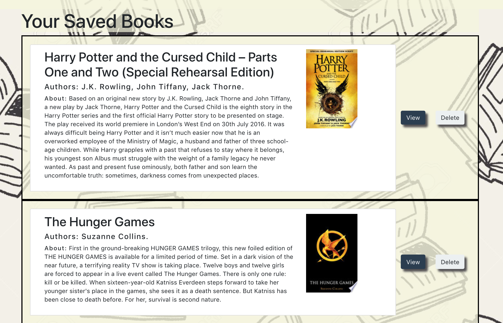
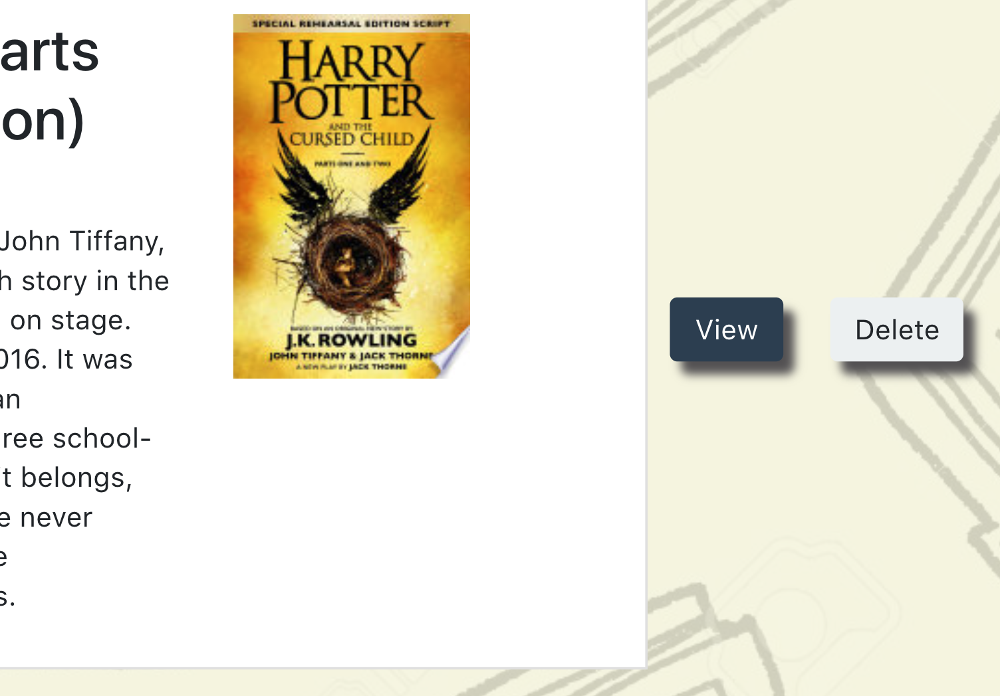

# react-google-book-search

[Deployed version](https://react-google-book-search-ma.herokuapp.com/)

This is a React-based Google Books Search app.

## Built with 
1. HTML.
2. Bootstrap
3. React
4. Express.
5. Mongoose.
6. Axios
7. Router

## How it works

1. The app allow users search for specific book. (Using Google book API [Google book API](https://developers.google.com/books))

2. Users can also save the book they like.

3. The book will be saved to MondoDB and displayed on the Saved page.

4. Also users can delete a book from Saved page.

